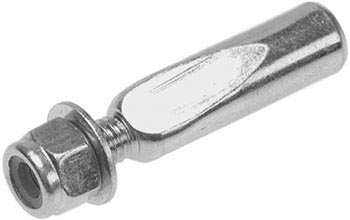
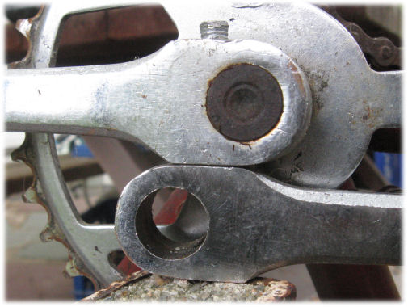

#Cottered Cranks

.

*Crank cotter with nut and washer*

Many older bicycles use wedge-shaped fasteners called "cotters" to hold the [cranks](http://sheldonbrown.com/glossary.html#crank) onto the [bottom bracket](http://sheldonbrown.com/gloss_bo-z.html#bottom) [axle](http://sheldonbrown.com/glossary.html#axle).

These cotters have a nut to hold them in place after they have been driven or pressed in.

They can be difficult to remove, especially if they have been in place for a long time.

#Removing Cotters

Recalcitrant crank cotters are among the most challenging bicycle repair problems. The first thing to try, if you have one available, is a cotter pin press. [Park](http://sheldonbrown.com/gloss_p.html#park) makes the best one I know of, it is basically a super-heavy-duty "C" clamp. Var also makes a cotter pin press that uses a cam and long handles like those of a bolt cutter. I broke one once :-(>

[Update, September, 2103: Park and Var cotter pin presses have been discontinued but (one is available from Bikesmith)[http://www.bikesmithdesign.com/CotterPress/].]

The hammer and pipe system is best if you don't have a press, or if the press fails. You need a short length of pipe, long enough to go from the underside of the crank to the floor. Wedge it in position so that the non-threaded end of the cotter can fit inside of it. The pipe will transmit the impact of the hammer to the floor, so as not to damage the bearing cups or axle cones. It is best to rest the pipe on a concrete floor or to place a thick, steel pad under the end of the pipe. You could damage a wooden floor, and as the pipe indents the floor, it won't provide as good protection to the bearings.

The more rigid the support, the better your luck is likely to be. One neat trick is to place the head of the cotter inside another cottered crank, used as an anvil as shown in the photo below. (Use a left crank so there won't be a chainwheel or crank spider in the way of your hammer.) The crank in the photo is resting on a steel fencepost which is filled with concrete and set in concrete at its base. The cotter shown, already mushroomed by several failed attempts, let go with one hammer blow when resting on this support.You could also rest the assembly on a bench vise or an actual blacksmith's anvil, if you have one.

*Second cottered crank as anvil*

To be sure, a really rigid support can blemish the crank -- but these days, most cottered-crank replacements will be with new, lighter, more trouble-free cotterless cranks.

I prefer a claw hammer to a ball peen. Claw hammers are designed to drive nails without bending them, and that is very similar to what you want to do to a cotter. Most people are scared to hit a bicycle with a hammer, and are afraid they will miss if they swing too hard. They go "tappy-tappy-tap", nothing happens, then they try hitting a bit harder, then harder still, until the end of the cotter is mushroomed over or bends. If you are going to hammer a cotter, pretend that you are going to try to smash the crank right off the axle. Hold the hammer by the end of the handle, and give it everything you've got! It may work, or you may just bend the end of the cotter over. If you bend it, use the claw of the claw hammer to straighten it, then try again. If you repeat this cycle unsuccessfully a few times, the threaded end of the cotter will snap off.

#Removing Difficult Cotters

The next line of attack is to use a punch (drift) to drive out the remnants. The ideal tool for this is a discarded pedal axle: they are the right shape, and the right kind of steel. Nothing you can buy is better.

Nobody is brave (or foolish) enough to hit the punch as hard as it needs to be hit while holding it in their hand. Use a Vise Grip (tm) or similar locking pliers to hold the punch from a safe distance, and whale away.

If this doesn't work, the next thing to try is drilling the cotter. You cannot drill the whole cotter out, because the drill would hit the axle, which is as hard as the drill bit.

Use a 1/4 inch drill bit or so. Drilling a hole through the cotter will relieve some of the pressure, and attacking again with the punch will usually do the trick.

The final assault, if all else fails, is to warm up the crank with a propane torch. You don't have to get it red hot, just pretty warm-too hot to touch, anyway. This has never failed for me, so I don't know what I would do if it did. Perhaps unscrewing the cup without removing the cotter, assuming that I was able to get one side off...

#Installing cotters

The flat on a cotter is at an angle to the centerline of the cotter. When installing cotters, they must face in opposite directions so that the angles of the flats will cancel out and the cranks will wind up 180 degrees apart.

Some older books speak of installing the cotter so that the pedaling load is taken by the thick end of the cotter. This is an error, because if you do the right side that way, the left side will be stressing the thin end, and vice versa, and the cranks will not be 180 degrees apart. It really doesn't matter which way you put them in, as long as they face in opposite directions. [Exception: a cyclist who rides in trousers with loose cuffs has more to catch them on if the nutted end of the cotter faces upward when the crank is forward. There's a host of additional reasons to secure trouser cuffs -- John Allen]

Replacement cotters that fit well are not always easy to find. There is very limited interchangeability. The diameter of the round part of the cotter tends to be standardized according to nationality. Most use 9.5 mm, including British, Asian and most German bicycles. French and Italian bicycles used 9 mm, or sometimes 8.5 mm.

In addition to the diameter of the cotter, the depth and angle of the flat vary considerably. For this reason, it is best to replace cotters in pairs. If mismatched cotters are installed, the cranks will not be 180 degrees apart.

#Filing cotters to fit

It is commonly necessary to file the flats to fit. To file a cotter, put it in a vise at an angle so that the flat is parallel to the vise jaws. When filing, apply a slight twisting force to the file handle to apply more pressure to the wide side of the flat, to help maintain the correct angle of the flat.

Be careful to move the file in a straight line; it is easy to rock the file as you push it across the cotter, creating a rounded surface instead of the desired flat.

#Tightening Cotters
You cannot get a cotter tight enough by tightening the nut: you must use a press or a hammer. Cotters are made of fairly soft steel, so that they won't damage the axle. If you try to tighten them just by turning the nut, either you won't get them tight enough, or you will strip the threads.

After a cottered crank has been re-assembled, the bicycle should be ridden for a few dozen miles, then the cotter re-tightened with a press or hammer. If this is not done, the cotter will probably loosen up. If the bicycle is ridden with loose cotters, the motion of the crank will cause the axle to cut notches into the cotters, and it will become impossible to tighten them.

